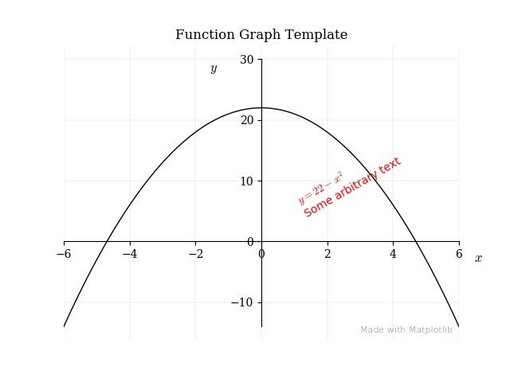

## Matplotlib Templates
### Background
I frequently need customised graphs of functions, equations or other figures in my work as a teacher in maths and physics. With [Matplotlib](https://matplotlib.org) and [Python](https://www.python.org) it is possible to create almost any type of graphics in any size. The downside is that the creation process is time consuming due to the need of specify all options in the plots and the code may go long. For me, it's not something I want to start from scratch with for each plot. Therefore, I started to create templates for different kind of plots.

### Simple Function Graphs
#### About
The code is in the file `simple_function_graphs.py`. Clone the project to any directory and modify the file.
This is the first contribution in my suite of templates. It's a frequently used kind plot for a maths teacher, a function graph with axes intersection in origo. The code and the comments are rather self explained.

#### Prequesites
* A Python 3.6 (or later) installation
* Matplotlib installed
* NumPy installed
* The directory structure in this project

Matplotlib Templates is **not** tested in any web based framework. They may or may not work.

#### Optional
In order to automatically publish the plots for global access, it's built in support for [Digital Ocean Spaces](https://www.digitalocean.com/docs/spaces/). This configuration demands

* A Digital Ocean Spaces account
If you have, you may want to configure your OS environment variables with
        * `REGION_NAME`, e.g. 'nyc3'
        * `GRAPH_BUCKET`, e.g. 'mygraphs'
        * `AWS_ACCESS_KEY_ID`, an ID string you get from Digital Ocean
        * `AWS_SECRET_ACCESS_KEY`, also an ID string you get from Digital Ocean
* The Python libraries `boto3` and `botocore`installed

I think an [Amazon S3](https://aws.amazon.com/s3/) account will work too, with a slight change in the library file `spacelib/tospace.py`.
#### Sample plot

### More to come...
I expect my self go further with a template for visualise statistical data visualised in bar charts, line charts and scatter plots, plots of equations of two variables and geometric figure plots.

> Written with [StackEdit](https://stackedit.io/).
